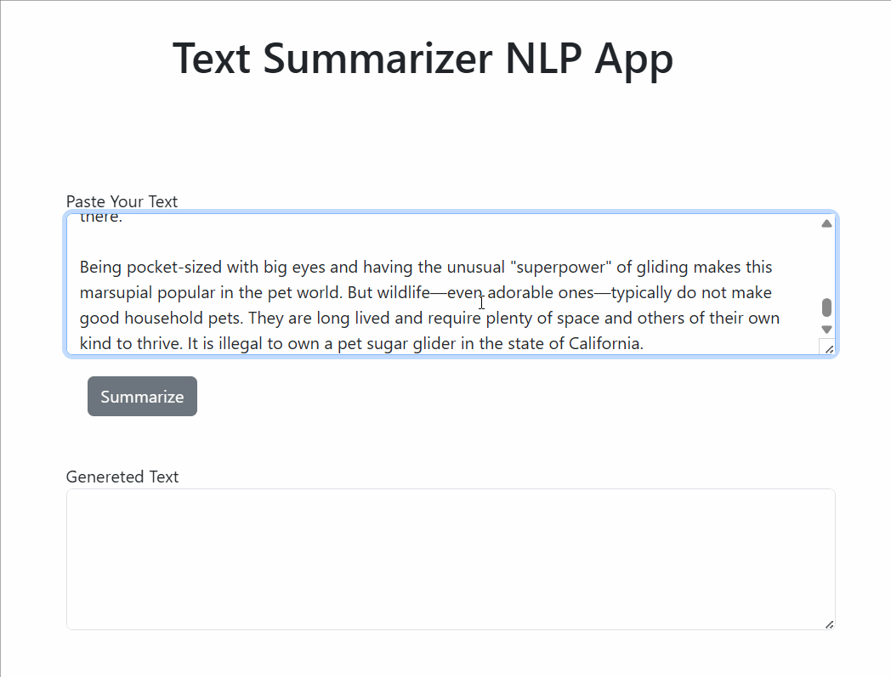

# Hands On Intro NLP lecture- 

**Machine Learning NLP hands on lecture focused on understanding the key NLP concepts, apply it by building**    

+ Plan for the Machine Learning NLP session at Lehman College 

Project : Text Summarization App
Project : Text Summarization App

+ ML & NLP definition
+ ML lifecycle
+ Data Cleaning, EDA, prepartion stages
+ Choosing a Model
+ Modle Evaluation
+ Learn a shortcut - how to use a prebuilt HugginFace Models ?
**Additional :**
+ Deply app with Flask 

+ Other:

+ datasets source : Kaggle
+ Build ML/NLP App tutorial with : HuggingFace model text Summary
+ Gemini Langgchain & LLM for a Text Summary App : link text
